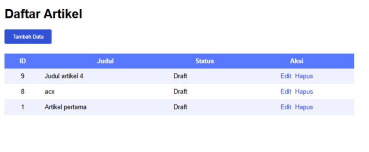
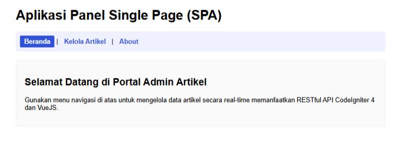
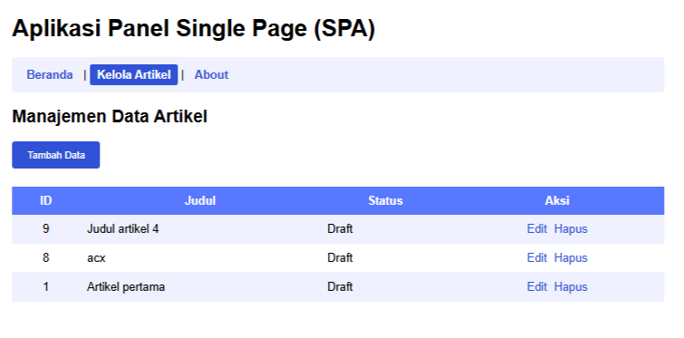
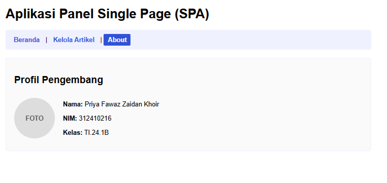
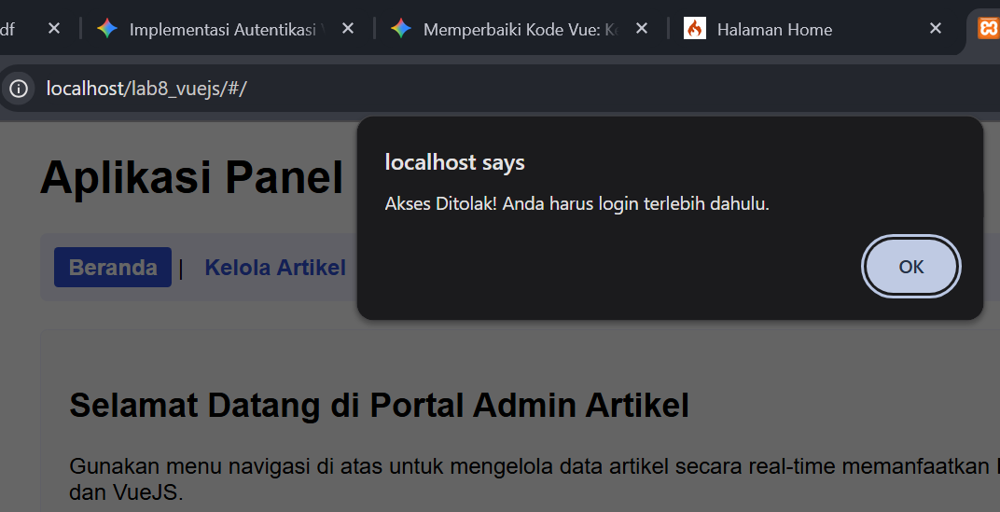
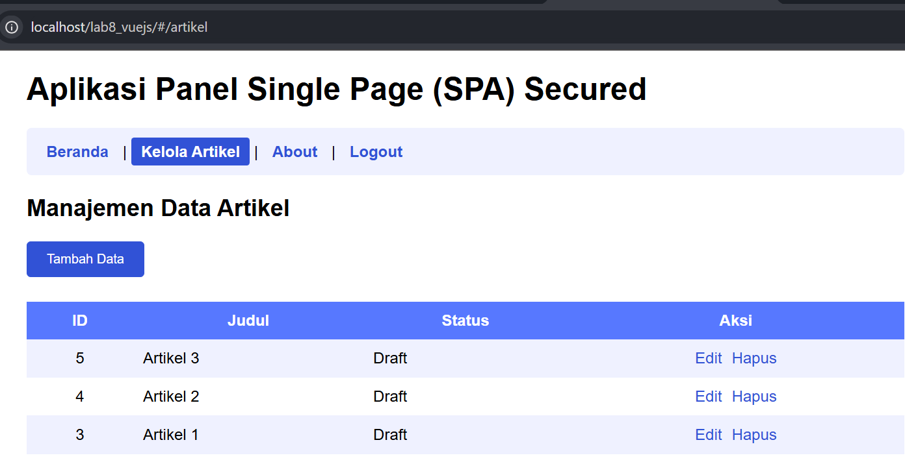
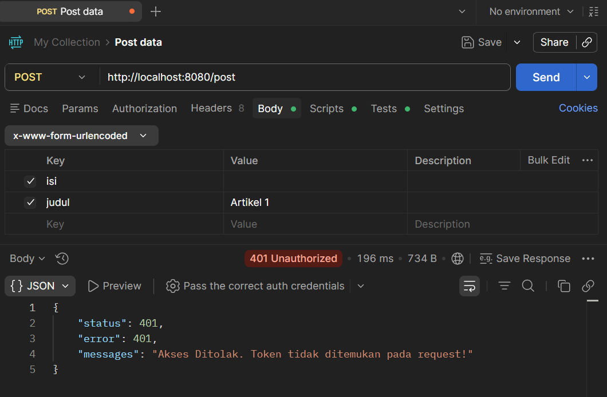
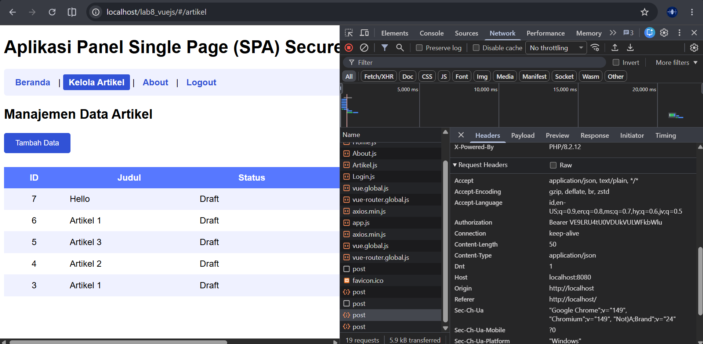

# Pratikum 11-14 Folder LAB8_VUEJS
## Struktur utama folder
```
lab8_vuejs/
├── assets/
│   ├── css/
│   │   └── style.css
│   └── js/
│       ├── app.js
│       └── components/
│           ├── Home.js
│           ├── Artikel.js
|           ├── Login.js
│           └── About.js  
└── index.html
```

---
# Praktikum 11: VueJS
## Struktur Direktory
```
Buat Project baru dengan struktur file dan directory seperti berikut:
│ index.html
└───assets
 ├───css
 │ style.css
 └───js
 app.js
```
### Menampilkan data File index.html
```html
<!DOCTYPE html>
<html lang="en">
<head>
    <meta charset="UTF-8">
    <meta name="viewport" content="width=device-width, initial-scale=1.0">
    <title>Frontend Vuejs</title>
    <script src="https://unpkg.com/vue@3/dist/vue.global.js"></script>
    <script src="https://unpkg.com/axios/dist/axios.min.js"></script>
    <link rel="stylesheet" href="assets/css/style.css">
</head>
<body>
    <div id="app">
        <h1>Daftar Artikel</h1>

        <button id="btn-tambah" @click="tambah">Tambah Data</button>

        <div class="modal" v-if="showForm">
            <div class="modal-content">
                <span class="close" @click="showForm = false">&times;</span>
                <form id="form-data" @submit.prevent="saveData">
                    <h3 id="form-title">{{ formTitle }}</h3>
                    
                    <div>
                        <input type="text" name="judul" v-model="formData.judul" placeholder="Judul" required>
                    </div>
                    <div>
                        <textarea name="isi" id="isi" rows="10" v-model="formData.isi" placeholder="Isi Artikel" required></textarea>
                    </div>
                    <div>
                        <select name="status" id="status" v-model="formData.status">
                            <option v-for="option in statusOptions" :key="option.value" :value="option.value">
                                {{ option.text }}
                            </option>
                        </select>
                    </div>

                    <input type="hidden" id="id" v-model="formData.id">
                    <button type="submit" id="btnSimpan">Simpan</button>
                    <button type="button" @click="showForm = false">Batal</button>
                </form>
            </div>
        </div>

        <table>
            <thead>
                <tr>
                    <th>ID</th>
                    <th>Judul</th>
                    <th>Status</th>
                    <th>Aksi</th>
                </tr>
            </thead>
            <tbody>
                <tr v-for="(row, index) in artikel" :key="row.id">
                    <td class="center-text">{{ row.id }}</td>
                    <td>{{ row.judul }}</td>
                    <td>{{ statusText(row.status) }}</td>
                    <td class="center-text">
                        <a href="#" @click.prevent="edit(row)">Edit</a>
                        <a href="#" @click.prevent="hapus(index, row.id)">Hapus</a>
                    </td>
                </tr>
            </tbody>
        </table>
    </div>

    <script src="assets/js/app.js"></script>
</body>
</html>
```

### File apps.js
```js
const { createApp } = Vue;

// Tentukan lokasi API REST End Point
const apiUrl = 'http://localhost:8080';

createApp({
    data() {
        return {
            artikel: [], // Menyimpan daftar artikel dari API
            formData: {
                id: null,
                judul: '',
                isi: '',
                status: 0
            },
            showForm: false,
            formTitle: 'Tambah Data',
            statusOptions: [
                { text: 'Draft', value: 0 },
                { text: 'Publish', value: 1 }
            ]
        };
    },
    mounted() {
        this.loadData();
    },
    methods: {
        // Ambil data dari API
        loadData() {
            axios.get(apiUrl + '/post')
                .then(response => {
                    this.artikel = response.data.artikel;
                })
                .catch(error => console.log(error));
        },
        // Setup Form untuk Tambah Data Baru
        tambah() {
            this.showForm = true;
            this.formTitle = 'Tambah Data';
            this.formData = {
                id: null,
                judul: '',
                isi: '',
                status: 0
            };
        },
        // Setup Form untuk Edit Data yang Dipilih
        edit(data) {
            this.showForm = true;
            this.formTitle = 'Ubah Data';
            this.formData = {
                id: data.id,
                judul: data.judul,
                isi: data.isi,
                status: data.status
            };
            console.log('Edit item:', data);
        },
        // Menyimpan Data (Tambah Baru atau Update data lama)
        saveData() {
            if (this.formData.id) {
                // Jalankan aksi PUT jika ID tersedia (Update)
                axios.put(apiUrl + '/post/' + this.formData.id, this.formData)
                    .then(response => {
                        this.loadData();
                        this.showForm = false;
                    })
                    .catch(error => console.log(error));
                console.log('Update item:', this.formData);
            } else {
                // Jalankan aksi POST jika ID bernilai null (Tambah Baru)
                axios.post(apiUrl + '/post', this.formData)
                    .then(response => {
                        this.loadData();
                        this.showForm = false;
                    })
                    .catch(error => console.log(error));
                console.log('Tambah item:', this.formData);
            }

            // Reset form data setelah selesai submit
            this.formData = {
                id: null,
                judul: '',
                isi: '',
                status: 0
            };
        },
        // Menghapus data dari server dan view
        hapus(index, id) {
            if (confirm('Yakin menghapus data?')) {
                axios.delete(apiUrl + '/post/' + id)
                    .then(response => {
                        this.artikel.splice(index, 1);
                    })
                    .catch(error => console.log(error));
            }
        },
        // Mengubah kode angka status menjadi teks terbaca
        statusText(status) {
            return status == 1 ? 'Publish' : 'Draft';
        }
    }
}).mount('#app');
```

### File style.css
```css
#app {
    margin: 0 auto;
    width: 900px;
    font-family: Arial, sans-serif;
}
table {
    min-width: 700px;
    width: 100%;
    border-collapse: collapse;
    margin-top: 10px;
}
th {
    padding: 10px;
    background: #5778ff !important;
    color: #ffffff;
}
tr td {
    border-bottom: 1px solid #eff1ff;
}
tr:nth-child(odd) {
    background-color: #eff1ff;
}
td {
    padding: 10px;
}
.center-text {
    text-align: center;
}
td a {
    margin: 5px;
    color: #3152d6;
    text-decoration: none;
}
td a:hover {
    text-decoration: underline;
}

/* Form Styles */
#form-data {
    width: 100%;
}
form input, form textarea, form select {
    width: 100%;
    margin-bottom: 10px;
    padding: 8px;
    box-sizing: border-box;
    border: 1px solid #ccc;
    border-radius: 4px;
}
form div {
    margin-bottom: 5px;
    position: relative;
}
form button {
    padding: 10px 20px;
    margin-top: 10px;
    margin-bottom: 10px;
    margin-right: 10px;
    cursor: pointer;
    border-radius: 4px;
    border: 1px solid #ccc;
}

/* Button Customizations */
#btn-tambah, #btnSimpan {
    margin-bottom: 15px;
    padding: 10px 20px;
    cursor: pointer;
    background-color: #3152d6;
    color: #ffffff;
    border: 1px solid #3152d6;
    border-radius: 4px;
}
#btn-tambah:hover, #btnSimpan:hover {
    background-color: #233fb3;
}

/* Modal Box Styles */
.modal {
    display: block; 
    position: fixed;
    z-index: 999;
    left: 0;
    top: 0;
    width: 100%;
    height: 100%;
    overflow: auto;
    background-color: rgba(0, 0, 0, 0.4);
}
.modal-content {
    background-color: #fefefe;
    margin: 10% auto;
    padding: 25px;
    border: 1px solid #888;
    width: 500px;
    border-radius: 8px;
    box-shadow: 0 4px 8px rgba(0,0,0,0.2);
}
.close {
    color: #aaa;
    float: right;
    font-size: 28px;
    font-weight: bold;
    cursor: pointer;
}
.close:hover {
    color: #000;
}
```

### Lalu tambahkan di app/Controllers/Post.php project lama atau lab11_ci
```php
// Tambahkan constructor ini agar semua fungsi mendapatkan izin CORS secara otomatis
    public function __construct()
    {
        header("Access-Control-Allow-Origin: *");
        header("Access-Control-Allow-Headers: X-API-KEY, Origin, X-Requested-With, Content-Type, Accept, Access-Control-Request-Method, Authorization");
        header("Access-Control-Allow-Methods: GET, POST, OPTIONS, PUT, DELETE");
        
        // Jika browser mengirimkan PREFLIGHT request (OPTIONS), langsung hentikan dengan status 200
        if ($_SERVER['REQUEST_METHOD'] === 'OPTIONS') {
            exit(0);
        }
    }
```

### Buka http://localhost/lab8_vuejs/



# Praktikum	12:	VueJS	Komponen	dan	Routing	(Single	Page Application)
```
lab8_vuejs/
├── assets/
│   ├── css/
│   │   └── style.css
│   └── js/
│       ├── app.js
│       └── components/
│           ├── Home.js
│           ├── Artikel.js
│           └── About.js  <-- (Ditambahkan untuk menyelesaikan Tugas Modul)
└── index.html
```
## Membuat Komponen Halaman Utama (assets/js/components/Home.js)
```js
const Home = {
    template: `
    <div class="home-container">
        <h2>Selamat Datang di Portal Admin Artikel</h2>
        <p>Gunakan menu navigasi di atas untuk mengelola data artikel secara real-time memanfaatkan RESTful API CodeIgniter 4 dan VueJS.</p>
    </div>
    `
};
```

## Membuat Komponen Manajemen Artikel (assets/js/components/Artikel.js)
```js
const Artikel = {
    template: `
    <div>
        <h2>Manajemen Data Artikel</h2>
        <button id="btn-tambah" @click="tambah">Tambah Data</button>
        
        <div class="modal" v-if="showForm">
            <div class="modal-content">
                <span class="close" @click="showForm = false">&times;</span>
                <form id="form-data" @submit.prevent="saveData">
                    <h3>{{ formTitle }}</h3>
                    <div>
                        <input type="text" v-model="formData.judul" placeholder="Judul Artikel" required>
                    </div>
                    <div>
                        <textarea v-model="formData.isi" rows="6" placeholder="Isi Artikel" required></textarea>
                    </div>
                    <div>
                        <select v-model="formData.status">
                            <option v-for="option in statusOptions" :key="option.value" :value="option.value">
                                {{ option.text }}
                            </option>
                        </select>
                    </div>
                    <input type="hidden" v-model="formData.id">
                    <button type="submit" id="btnSimpan">Simpan</button>
                    <button type="button" @click="showForm = false">Batal</button>
                </form>
            </div>
        </div>

        <table>
            <thead>
                <tr>
                    <th>ID</th>
                    <th>Judul</th>
                    <th>Status</th>
                    <th>Aksi</th>
                </tr>
            </thead>
            <tbody>
                <tr v-for="(row, index) in artikel" :key="row.id">
                    <td class="center-text">{{ row.id }}</td>
                    <td>{{ row.judul }}</td>
                    <td>{{ statusText(row.status) }}</td>
                    <td class="center-text">
                        <a href="#" @click.prevent="edit(row)">Edit</a>
                        <a href="#" @click.prevent="hapus(index, row.id)">Hapus</a>
                    </td>
                </tr>
            </tbody>
        </table>
    </div>
    `,
    data() {
        return {
            artikel: [],
            formData: { id: null, judul: '', isi: '', status: 0 },
            showForm: false,
            formTitle: 'Tambah Data',
            statusOptions: [
                { text: 'Draft', value: 0 },
                { text: 'Publish', value: 1 }
            ]
        }
    },
    mounted() {
        this.loadData();
    },
    methods: {
        loadData() {
            axios.get(apiUrl + '/post')
                .then(response => {
                    this.artikel = response.data.artikel;
                })
                .catch(error => console.log(error));
        },
        tambah() {
            this.showForm = true;
            this.formTitle = 'Tambah Data';
            this.formData = { id: null, judul: '', isi: '', status: 0 };
        },
        edit(data) {
            this.showForm = true;
            this.formTitle = 'Ubah Data';
            this.formData = { id: data.id, judul: data.judul, isi: data.isi, status: parseInt(data.status) };
        },
        saveData() {
            if (this.formData.id) {
                axios.put(apiUrl + '/post/' + this.formData.id, this.formData)
                    .then(response => {
                        this.loadData();
                        this.showForm = false;
                    })
                    .catch(error => console.log(error));
            } else {
                axios.post(apiUrl + '/post', this.formData)
                    .then(response => {
                        this.loadData();
                        this.showForm = false;
                    })
                    .catch(error => console.log(error));
            }
            this.formData = { id: null, judul: '', isi: '', status: 0 };
        },
        hapus(index, id) {
            if (confirm('Yakin menghapus data?')) {
                axios.delete(apiUrl + '/post/' + id)
                    .then(response => {
                        this.artikel.splice(index, 1);
                    })
                    .catch(error => console.log(error));
            }
        },
        statusText(status) {
            return status == 1 ? 'Publish' : 'Draft';
        }
    }
};
```

## Membuat Komponen Profil (assets/js/components/About.js)
```js
const About = {
    template: `
    <div class="home-container">
        <h2>Profil Pengembang</h2>
        <div style="display: flex; gap: 20px; align-items: center; margin-top: 15px;">
            <div style="width: 100px; height: 100px; background: #ddd; border-radius: 50%; display: flex; align-items: center; justify-content: center; font-weight: bold; color: #555;">
                FOTO
            </div>
            <div>
                <p><strong>Nama:</strong> Fawaz</p>
                <p><strong>NIM:</strong> 3122XXXXX (Isi NIM Anda)</p>
                <p><strong>Kelas:</strong> TI.22.XX (Isi Kelas Anda)</p>
            </div>
        </div>
    </div>
    `
};
```

## Mengonfigurasi Router Utama (assets/js/app.js) Edit file utama app.js
```js
const { createApp } = Vue;
const { createRouter, createWebHashHistory } = VueRouter;

// Lokasi API REST End Point disesuaikan dengan port php spark serve Anda
const apiUrl = 'http://localhost:8080';

// 1. Definisikan pemetaan rute URL ke Komponen (Termasuk halaman About)
const routes = [
    { path: '/', component: Home },
    { path: '/artikel', component: Artikel },
    { path: '/about', component: About } // Ditambahkan untuk menyelesaikan tugas modul
];

// 2. Buat instance router
const router = createRouter({
    history: createWebHashHistory(),
    routes
});

// 3. Inisialisasi Aplikasi Vue dan gunakan Router
const app = createApp({});
app.use(router);
app.mount('#app');
```

## Memodifikasi Halaman Master (index.html)
``` html
<!DOCTYPE html>
<html lang="en">
<head>
    <meta charset="UTF-8">
    <meta name="viewport" content="width=device-width, initial-scale=1.0">
    <title>SPA Frontend VueJS & Vue Router</title>
    <script src="https://unpkg.com/vue@3/dist/vue.global.js"></script>
    <script src="https://unpkg.com/vue-router@4/dist/vue-router.global.js"></script>
    <script src="https://unpkg.com/axios/dist/axios.min.js"></script>
    <link rel="stylesheet" href="assets/css/style.css">
</head>
<body>
    <div id="app">
        <header>
            <h1>Aplikasi Panel Single Page (SPA)</h1>
            <nav class="nav-menu">
                <router-link to="/">Beranda</router-link> |
                <router-link to="/artikel">Kelola Artikel</router-link> |
                <router-link to="/about">About</router-link> </nav>
        </header>

        <main style="margin-top: 20px;">
            <router-view></router-view>
        </main>
    </div>

    <script src="assets/js/components/Home.js"></script>
    <script src="assets/js/components/Artikel.js"></script>
    <script src="assets/js/components/About.js"></script> <script src="assets/js/app.js"></script>
</body>
</html>
```

## Memperbarui Desain Menu Navigasi (assets/css/style.css)
```css
/* --- Style Tambahan Navigasi Vue Router --- */
.nav-menu {
    padding: 10px;
    background: #eff1ff;
    border-radius: 5px;
    margin-bottom: 15px;
}

.nav-menu a {
    text-decoration: none;
    color: #3152d6;
    font-weight: bold;
    padding: 5px 10px;
    display: inline-block;
}

/* Style otomatis dari Vue Router saat route aktif */
.router-link-exact-active {
    background-color: #3152d6;
    color: #ffffff !important;
    border-radius: 3px;
}

.home-container {
    padding: 20px;
    border: 1px solid #eff1ff;
    background: #fafafa;
    border-radius: 5px;
}
```

## Uji test
```
Jalankan file lama di http://localhost:8080/
Lalu jalankan file baru lab8_vuejs di http://localhost/lab8_vuejs/#/
```






# Pratikum 12 :VueJS	Autentikasi	dan	Navigation	Guards	(SPA Security)
## Buat berkas controller baru di proyek backend Anda pada direktori app/Controllers/Api/Auth.php
```php
<?php

namespace App\Controllers\Api;

use CodeIgniter\RESTful\ResourceController;
use App\Models\UserModel;

class Auth extends ResourceController
{
    protected $format = 'json';

    public function login()
    {
        try {
            $username = $this->request->getVar('username');
            $password = $this->request->getVar('password');

            if (empty($username) || empty($password)) {
                return $this->respond([
                    'status'   => 400,
                    'messages' => 'Username dan Password wajib diisi.'
                ], 400);
            }

            $model = new UserModel();

            $user = $model->where('username', $username)
                          ->orWhere('useremail', $username)
                          ->first();

            if ($user) {
                // Cari nama kolom password
                $dbPassword = isset($user['userpassword']) ? $user['userpassword'] : (isset($user['password']) ? $user['password'] : null);

                if ($dbPassword === null) {
                    return $this->respond(['status' => 500, 'messages' => 'Kolom password tidak ditemukan di DB.'], 500);
                }

                // Verifikasi Password
                $isPasswordValid = false;
                if ($password === $dbPassword || password_verify($password, $dbPassword)) {
                    $isPasswordValid = true;
                }

                if ($isPasswordValid) {
                    return $this->respond([
                        'status'   => 200,
                        'error'    => null,
                        'messages' => 'Login Berhasil',
                        'data'     => [
                            'id'       => $user['id'] ?? null,
                            'username' => $user['username'],
                            'token'    => base64_encode("TOKEN-SECRET-" . $user['username'])
                        ]
                    ], 200);
                }
            }

            return $this->respond(['status' => 401, 'messages' => 'Username atau Password salah.'], 401);

        } catch (\Exception $e) {
            return $this->respond(['status' => 500, 'messages' => 'Error: ' . $e->getMessage()], 500);
        }
    }
}
```

## Buat file baru bernama Login.js di dalam folder assets/js/components/Login.js di lab8_vuejs/
```php
const Login = {
    template: `
        <div class="login-container">
            <div class="login-box">
                <h2>Form Login Admin</h2>
                <form @submit.prevent="handleLogin">
                    <div class="form-group">
                        <label>Username / Email</label>
                        <input type="text" v-model="username" placeholder="Masukkan username" required>
                    </div>
                    <div class="form-group">
                        <label>Password</label>
                        <input type="password" v-model="password" placeholder="Masukkan password" required>
                    </div>
                    <button type="submit" class="btn-login">Masuk Aplikasi</button>
                </form>
                <p v-if="errorMessage" class="error-msg">{{ errorMessage }}</p>
            </div>
        </div>
    `,
    data() {
        return {
            username: '',
            password: '',
            errorMessage: ''
        }
    },
    methods: {
        handleLogin() {
            // Mengirim data kredensial ke API Endpoint backend CI4
            axios.post(apiUrl + '/api/login', {
                username: this.username,
                password: this.password
            })
            .then(response => {
                if (response.data.status === 200) {
                    // Simpan status otentikasi riil dari server ke local storage browser
                    localStorage.setItem('isLoggedIn', 'true');
                    localStorage.setItem('userToken', response.data.data.token);
                    
                    // Alihkan halaman ke manajemen artikel secara programatis
                    this.$router.push('/artikel');
                    window.location.reload();
                }
            })
            .catch(error => {
                // Tangkap pesan error dari response backend jika gagal login
                if (error.response && error.response.data.messages) {
                    this.errorMessage = error.response.data.messages;
                } else {
                    this.errorMessage = 'Terjadi kesalahan jaringan atau server.';
                }
            });
        }
    }
};
```

## Menyesuaikan Tata Letak Dinamis pada index.html
```html
<!DOCTYPE html>
<html lang="en">
<head>
    <meta charset="UTF-8">
    <meta name="viewport" content="width=device-width, initial-scale=1.0">
    <title>Secured SPA Frontend VueJS</title>
    <script src="https://unpkg.com/vue@3/dist/vue.global.js"></script>
    <script src="https://unpkg.com/vue-router@4/dist/vue-router.global.js"></script>
    <script src="https://unpkg.com/axios/dist/axios.min.js"></script>
    <link rel="stylesheet" href="assets/css/style.css">
</head>
<body>
    <div id="app">
        <header>
            <h1>Aplikasi Panel Single Page (SPA) Secured</h1>
            <nav class="nav-menu">
                <router-link to="/">Beranda</router-link> |
                <router-link to="/artikel">Kelola Artikel</router-link> |
                <router-link to="/about">About</router-link> | 
                
                <router-link v-if="!isLoggedIn" to="/login">Login</router-link>
                <a v-else href="#" @click.prevent="logout">Logout</a>
            </nav>
        </header>

        <main style="margin-top: 20px;">
            <router-view></router-view>
        </main>
    </div>

    <script src="assets/js/components/Home.js"></script>
    <script src="assets/js/components/About.js"></script> <script src="assets/js/components/Artikel.js"></script>
    <script src="assets/js/components/Login.js"></script>
    <script src="assets/js/app.js"></script>
</body>
</html>
```

## pengujian skenario kontrol keamanan
### Skenario A (Kondisi Terkunci)



### Skenario B (Kondisi Login Terautentikasi)



# Praktikum 14: Keamanan API, Autentikasi Token, dan Axios Interceptors.  
## Buat file baru bernama ApiAuthFilter.php di dalam folder app/Filters/
```php
<?php

namespace App\Filters;

use CodeIgniter\Filters\FilterInterface;
use CodeIgniter\Http\RequestInterface;
use CodeIgniter\Http\ResponseInterface;
use Config\Services;

class ApiAuthFilter implements FilterInterface
{
    public function before(RequestInterface $request, $arguments = null)
    {
        // 1. Ambil data Header Authorization dari request klien [cite: 41]
        $authHeader = $request->getServer('HTTP_AUTHORIZATION');

        if (!$authHeader) {
            // Jika header tidak ditemukan, kirim respon error 401 [cite: 44]
            $response = Services::response();
            $response->setStatusCode(401);
            return $response->setJSON([
                'status'   => 401,
                'error'    => 401,
                'messages' => 'Akses Ditolak. Token tidak ditemukan pada request!' [cite: 50]
            ]);
        }

        // 2. Ekstrak string token (Memisahkan kata 'Bearer' dengan string token) [cite: 53]
        $token = null;
        if (preg_match('/Bearer\s(\S+)/', $authHeader, $matches)) {
            $token = $matches[1]; [cite: 56]
        }

        // 3. Validasi Token [cite: 58]
        if (!$token || empty($token)) {
            $response = Services::response();
            $response->setStatusCode(401); [cite: 66]
            return $response->setJSON([
                'status'   => 401,
                'error'    => 401,
                'messages' => 'Sesi Token tidak valid atau kedaluwarsa!' [cite: 73]
            ]);
        }
    }

    public function after(RequestInterface $request, ResponseInterface $response, $arguments = null)
    {
        // Tidak diperlukan aksi setelah request diproses [cite: 76]
    }
}
```

### test simulasi pengujian pembobolan database menggunakan aplikasi REST Client 



### Authorization: Bearer <deretan_kode_token_anda>

